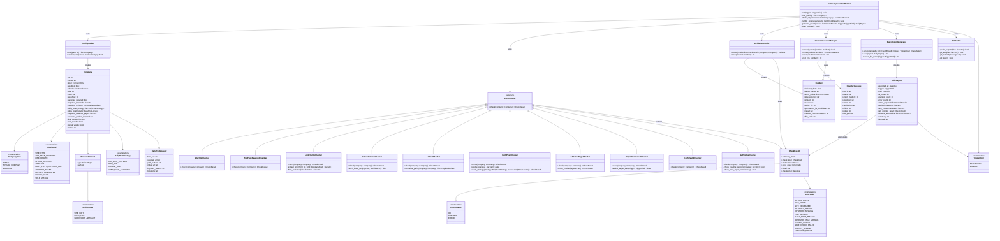

# クラス図

```mermaid
classDiagram

  %% ========== エントリポイント ==========
  class CompanyGuardianRunner {
    +run(trigger: TriggerKind) void
    -load_config() list~Company~
    -check_all(companies: list~Company~) list~CheckResult~
    -handle_anomalies(results: list~CheckResult~) void
    -generate_report(results: list~CheckResult~, trigger: TriggerKind) DailyReport
    -push_outputs() void
  }

  class TriggerKind {
    <<enumeration>>
    SCHEDULED
    MANUAL
  }

  %% ========== 設定 ==========
  class ConfigLoader {
    +load(path: str) list~Company~
    +validate(companies: list~Company~) bool
  }

  class Company {
    +id: str
    +name: str
    +kind: CompanyKind
    +enabled: bool
    +checks: list~CheckKind~
    +site: str
    +repo: str
    +workflow: str
    +adsense_required: bool
    +required_keywords: list~str~
    +required_artifacts: list~RequiredArtifact~
    +daily_post_strategy: list~DailyPostStrategy~
    +daily_post_locator: DailyPostLocator
    +required_adsense_pages: list~str~
    +adsense_marker_keyword: str
    +link_targets: list~str~
    +self_monitor: bool
    +portal_visible: bool
    +notes: str
  }

  class CompanyKind {
    <<enumeration>>
    PORTAL
    VIRTUAL_COMPANY
    GUARDIAN
  }

  class RequiredArtifact {
    +type: ArtifactType
    +path: str
  }

  class ArtifactType {
    <<enumeration>>
    SITE_PATH
    REPO_PATH
    WORKFLOW_ARTIFACT
  }

  class DailyPostStrategy {
    <<enumeration>>
    SITE_PATH_PATTERN
    FEED_XML
    SITEMAP_XML
    INDEX_PAGE_KEYWORD
  }

  class DailyPostLocator {
    +feed_url: str
    +sitemap_url: str
    +path_pattern: str
    +index_url: str
    +keyword_pattern: str
    +timezone: str
  }

  class CheckKind {
    <<enumeration>>
    SITE_HTTP
    TOP_PAGE_KEYWORD
    LINK_HEALTH
    GITHUB_ACTIONS
    ARTIFACT
    DAILY_POST_PREVIOUS_DAY
    ADSENSE_PAGES
    REPORT_GENERATED
    CONFIG_VALID
    SELF_STATUS
  }

  %% ========== チェッカー ==========
  class BaseChecker {
    <<abstract>>
    +check(company: Company) CheckResult
  }

  class SiteHttpChecker {
    +check(company: Company) CheckResult
  }

  class TopPageKeywordChecker {
    +check(company: Company) CheckResult
  }

  class LinkHealthChecker {
    +check(company: Company) CheckResult
    -extract_links(html: str, kind: CompanyKind) list~str~
    -filter_excluded(links: list~str~) list~str~
  }

  class GithubActionsChecker {
    +check(company: Company) CheckResult
    -fetch_latest_run(repo: str, workflow: str) dict
  }

  class ArtifactChecker {
    +check(company: Company) CheckResult
    -normalize_paths(company: Company) list~RequiredArtifact~
  }

  class DailyPostChecker {
    +check(company: Company) CheckResult
    -resolve_previous_day_jst() date
    -check_strategy(strategy: DailyPostStrategy, locator: DailyPostLocator) CheckResult
  }

  class AdSensePageChecker {
    +check(company: Company) CheckResult
    -check_marker(keyword: str) CheckStatus
  }

  class ReportGeneratedChecker {
    +check(company: Company) CheckResult
    -resolve_target_date(trigger: TriggerKind) date
  }

  class ConfigValidChecker {
    +check(company: Company) CheckResult
  }

  class SelfStatusChecker {
    +check(company: Company) CheckResult
    -check_readme_sections(required: list~str~) bool
    -check_prev_report_consistency() bool
  }

  %% ========== チェック結果 ==========
  class CheckResult {
    +company_id: str
    +check_kind: CheckKind
    +status: CheckStatus
    +error_code: ErrorCode
    +detail: str
    +checked_at: datetime
  }

  class CheckStatus {
    <<enumeration>>
    OK
    WARNING
    ERROR
  }

  class ErrorCode {
    <<enumeration>>
    ACTION_FAILED
    SITE_DOWN
    SITE_DEGRADED
    ARTIFACT_MISSING
    KEYWORD_MISSING
    LINK_BROKEN
    DAILY_POST_MISSING
    ADSENSE_PAGE_MISSING
    CONFIG_INVALID
    SELF_CHECK_FAILED
    REPORT_MISSING
    UNKNOWN_ERROR
  }

  %% ========== 記録・出力 ==========
  class IncidentRecorder {
    +create(results: list~CheckResult~, company: Company) Incident
    +save(incident: Incident) str
  }

  class Incident {
    +incident_date: date
    +target_name: str
    +error_codes: list~ErrorCode~
    +phenomenon: str
    +impact: str
    +cause: str
    +quick_fix: str
    +permanent_fix_candidates: str
    +result: str
    +related_countermeasure: str
    +file_path: str
  }

  class CountermeasureManager {
    +should_create(incident: Incident) bool
    +create(incident: Incident) Countermeasure
    +save(cm: Countermeasure) str
    -next_cm_number() int
  }

  class Countermeasure {
    +cm_id: str
    +name: str
    +origin_incident: str
    +condition: str
    +steps: str
    +verification: str
    +effect: str
    +notes: str
    +file_path: str
  }

  class DailyReportGenerator {
    +generate(results: list~CheckResult~, trigger: TriggerKind) DailyReport
    +save(report: DailyReport) str
    -resolve_file_name(trigger: TriggerKind) str
  }

  class DailyReport {
    +executed_at: datetime
    +trigger: TriggerKind
    +total_count: int
    +ok_count: int
    +warning_count: int
    +error_count: int
    +action_required: list~CheckResult~
    +applied_measures: list~str~
    +new_countermeasures: list~str~
    +self_monitor_result: CheckResult
    +adsense_anomalies: list~CheckResult~
    +summary: str
    +file_path: str
  }

  class GitPusher {
    +push_outputs(files: list~str~) bool
    -git_add(files: list~str~) void
    -git_commit(message: str) void
    -git_push() bool
  }

  %% ========== 関係 ==========
  CompanyGuardianRunner --> ConfigLoader : uses
  CompanyGuardianRunner --> BaseChecker : uses
  CompanyGuardianRunner --> IncidentRecorder : uses
  CompanyGuardianRunner --> CountermeasureManager : uses
  CompanyGuardianRunner --> DailyReportGenerator : uses
  CompanyGuardianRunner --> GitPusher : uses
  CompanyGuardianRunner --> TriggerKind

  ConfigLoader --> Company : creates

  Company --> CompanyKind
  Company --> CheckKind
  Company --> RequiredArtifact
  Company --> DailyPostStrategy
  Company --> DailyPostLocator
  RequiredArtifact --> ArtifactType

  BaseChecker <|-- SiteHttpChecker
  BaseChecker <|-- TopPageKeywordChecker
  BaseChecker <|-- LinkHealthChecker
  BaseChecker <|-- GithubActionsChecker
  BaseChecker <|-- ArtifactChecker
  BaseChecker <|-- DailyPostChecker
  BaseChecker <|-- AdSensePageChecker
  BaseChecker <|-- ReportGeneratedChecker
  BaseChecker <|-- ConfigValidChecker
  BaseChecker <|-- SelfStatusChecker

  BaseChecker --> CheckResult : returns
  CheckResult --> CheckStatus
  CheckResult --> ErrorCode

  IncidentRecorder --> Incident : creates
  IncidentRecorder --> CheckResult : uses

  CountermeasureManager --> Countermeasure : creates
  CountermeasureManager --> Incident : uses

  DailyReportGenerator --> DailyReport : creates
  DailyReport --> CheckResult : aggregates
  DailyReport --> TriggerKind
```
