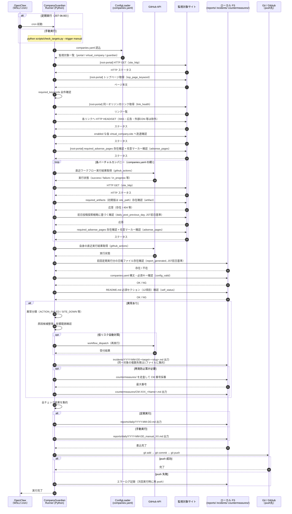
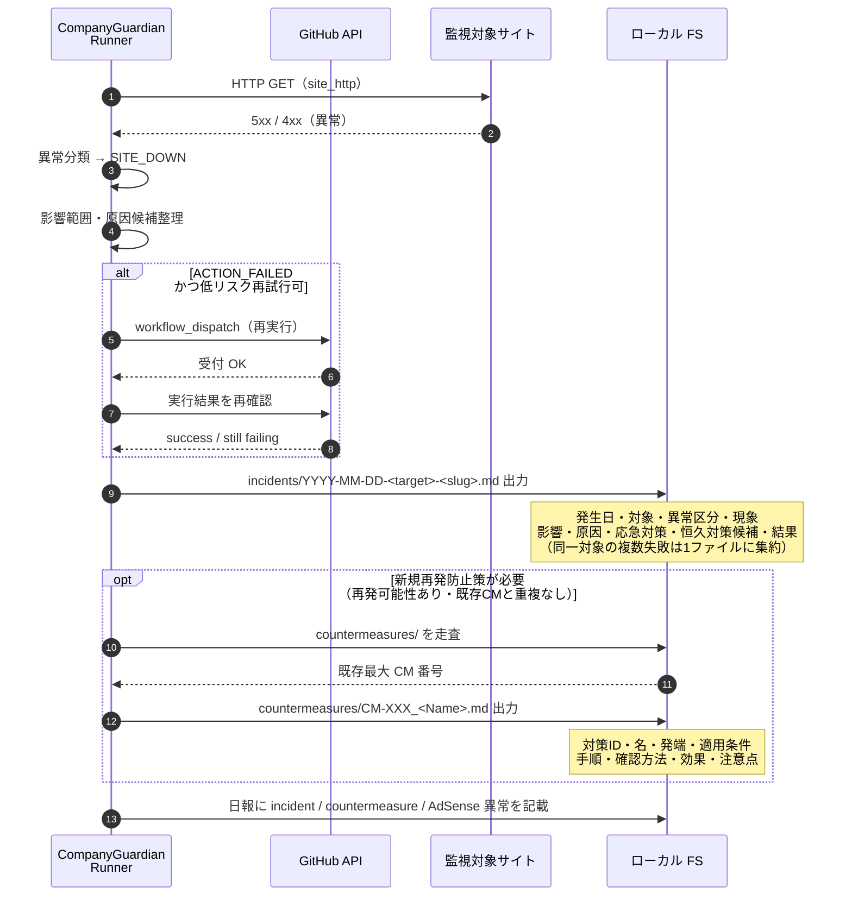

# シーケンス図

## 通常フロー（日次巡回）

```mermaid
sequenceDiagram
  autonumber
  participant OpenClaw as OpenClaw<br/>（WSL2 cron）
  participant Runner as CompanyGuardian<br/>Runner (Python)
  participant Config as ConfigLoader<br/>(companies.yaml)
  participant GitHubAPI as GitHub API
  participant Site as 監視対象サイト
  participant FS as ローカル FS<br/>(reports/ incidents/ countermeasures/)
  participant Git as Git / GitHub<br/>（push先）

  alt 定期実行（JST 06:00）
    OpenClaw->>Runner: cron 起動
  else 手動実行
    Note over Runner: python scripts/check_targets.py --trigger manual
  end

  Runner->>Config: companies.yaml 読込
  Config-->>Runner: 監視対象一覧（portal / virtual_company / guardian）

  %% Root Portal 監視
  Runner->>Site: [root-portal] HTTP GET（site_http）
  Site-->>Runner: HTTP ステータス
  Runner->>Site: [root-portal] トップページ取得（top_page_keyword）
  Site-->>Runner: ページ本文
  Runner->>Runner: required_keywords 全件確認
  Runner->>Site: [root-portal] 同一オリジン内リンク取得（link_health）
  Site-->>Runner: リンク一覧
  Runner->>Site: 各リンクへ HTTP HEAD/GET（SNS・広告・外部CDN 等は除外）
  Site-->>Runner: ステータス
  Runner->>Site: enabled な各 virtual_company.site へ到達確認
  Site-->>Runner: ステータス
  Runner->>Site: [root-portal] required_adsense_pages 存在確認 + 任意マーカー確認（adsense_pages）
  Site-->>Runner: ステータス

  %% 各バーチャルカンパニー監視（1社分を例示）
  loop 各バーチャルカンパニー（companies.yaml の順）
    Runner->>GitHubAPI: 直近ワークフロー実行結果取得（github_actions）
    GitHubAPI-->>Runner: 実行状態（success / failure / in_progress 等）
    Runner->>Site: HTTP GET（site_http）
    Site-->>Runner: HTTP ステータス
    Runner->>Site: required_artifacts（初期版は site_path）存在確認（artifact）
    Site-->>Runner: 応答（存在 / 404 等）
    Runner->>Site: 前日投稿探索戦略に基づく確認（daily_post_previous_day, JST前日基準）
    Site-->>Runner: 応答
    Runner->>Site: required_adsense_pages 存在確認 + 任意マーカー確認（adsense_pages）
    Site-->>Runner: ステータス
  end

  %% 自己監視
  Runner->>GitHubAPI: 自身の直近実行結果取得（github_actions）
  GitHubAPI-->>Runner: 実行状態
  Runner->>FS: 前回定期実行分の日報ファイル存在確認（report_generated, JST前日基準）
  FS-->>Runner: 存在 / 不在
  Runner->>FS: companies.yaml 構文・必須キー確認（config_valid）
  FS-->>Runner: OK / NG
  Runner->>FS: README.md 必須セクション（12項目）確認（self_status）
  FS-->>Runner: OK / NG

  %% 異常時：インシデント・再発防止策生成
  alt 異常あり
    Runner->>Runner: 異常分類（ACTION_FAILED / SITE_DOWN 等）
    Runner->>Runner: 原因候補整理・影響範囲確認
    opt 低リスク自動対策
      Runner->>GitHubAPI: workflow_dispatch（再実行）
      GitHubAPI-->>Runner: 受付結果
    end
    Runner->>FS: incidents/YYYY-MM-DD-<target>-<slug>.md 出力<br/>（同一対象の複数失敗は1ファイルに集約）
    opt 再発防止策が必要
      Runner->>FS: countermeasures/ を走査して CM 番号採番
      FS-->>Runner: 最大番号
      Runner->>FS: countermeasures/CM-XXX_<Name>.md 出力
    end
  end

  %% 日報生成
  Runner->>Runner: 全チェック結果を集約
  alt 定期実行
    Runner->>FS: reports/daily/YYYY-MM-DD.md 出力
  else 手動実行
    Runner->>FS: reports/daily/YYYY-MM-DD_manual_XX.md 出力
  end
  FS-->>Runner: 書込完了

  %% GitHub へ push
  Runner->>Git: git add → git commit → git push
  alt push 成功
    Git-->>Runner: 完了
  else push 失敗
    Runner->>FS: エラーログ記録（次回実行時に再 push）
  end
  Runner-->>OpenClaw: 実行完了
```

---

## 異常時フロー（詳細）

```mermaid
sequenceDiagram
  autonumber
  participant Runner as CompanyGuardian<br/>Runner
  participant GitHubAPI as GitHub API
  participant Site as 監視対象サイト
  participant FS as ローカル FS

  Runner->>Site: HTTP GET（site_http）
  Site-->>Runner: 5xx / 4xx（異常）

  Runner->>Runner: 異常分類 → SITE_DOWN
  Runner->>Runner: 影響範囲・原因候補整理

  alt ACTION_FAILED かつ低リスク再試行可
    Runner->>GitHubAPI: workflow_dispatch（再実行）
    GitHubAPI-->>Runner: 受付 OK
    Runner->>GitHubAPI: 実行結果を再確認
    GitHubAPI-->>Runner: success / still failing
  end

  Runner->>FS: incidents/YYYY-MM-DD-<target>-<slug>.md 出力
  Note over FS: 発生日・対象・異常区分・現象<br/>影響・原因・応急対策・恒久対策候補・結果<br/>（同一対象の複数失敗は1ファイルに集約）

  opt 新規再発防止策が必要<br/>（再発可能性あり・既存CMと重複なし）
    Runner->>FS: countermeasures/ を走査
    FS-->>Runner: 既存最大 CM 番号
    Runner->>FS: countermeasures/CM-XXX_<Name>.md 出力
    Note over FS: 対策ID・名・発端・適用条件<br/>手順・確認方法・効果・注意点
  end

  Runner->>FS: 日報に incident / countermeasure / AdSense 異常を記載
```
