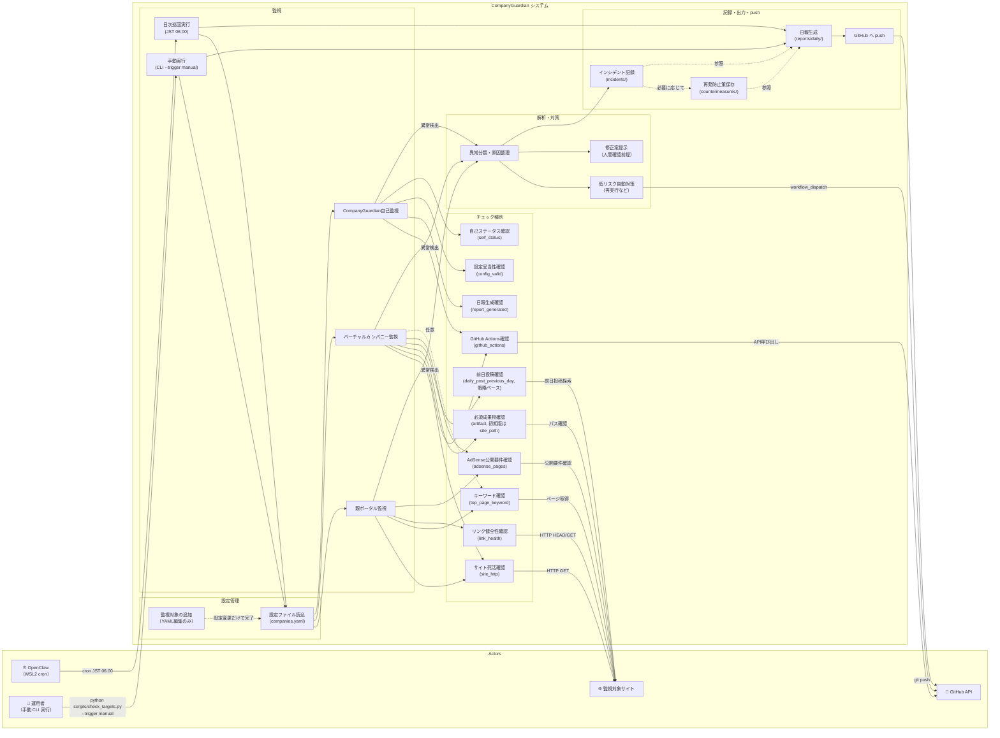

# ユースケース図

```mermaid
graph LR
  subgraph Actors
    OpenClaw["⏰ OpenClaw\n（WSL2 cron）"]
    Operator["👤 運用者\n（手動 CLI 実行）"]
    GitHubAPI["🐙 GitHub API"]
    TargetSite["🌐 監視対象サイト"]
  end

  subgraph CompanyGuardian システム

    subgraph UC_Config["設定管理"]
      UC1["設定ファイル読込\n(companies.yaml)"]
      UC2["監視対象の追加\n（YAML編集のみ）"]
    end

    subgraph UC_Monitor["監視"]
      UC3["日次巡回実行\n(JST 06:00)"]
      UC4["手動実行\n(CLI --trigger manual)"]
      UC5["親ポータル監視"]
      UC6["バーチャルカンパニー監視"]
      UC7["CompanyGuardian自己監視"]
    end

    subgraph UC_Check["チェック種別"]
      UC8["サイト死活確認\n(site_http)"]
      UC9["キーワード確認\n(top_page_keyword)"]
      UC10["リンク健全性確認\n(link_health)"]
      UC11["GitHub Actions確認\n(github_actions)"]
      UC12["必須成果物確認\n(artifact, 初期版は site_path)"]
      UC13["前日投稿確認\n(daily_post_previous_day, 戦略ベース)"]
      UC14["AdSense公開要件確認\n(adsense_pages)"]
      UC15["日報生成確認\n(report_generated)"]
      UC16["設定妥当性確認\n(config_valid)"]
      UC17["自己ステータス確認\n(self_status)"]
    end

    subgraph UC_Analyze["解析・対策"]
      UC18["異常分類・原因整理"]
      UC19["低リスク自動対策\n（再実行など）"]
      UC20["修正案提示\n（人間確認前提）"]
    end

    subgraph UC_Record["記録・出力・push"]
      UC21["インシデント記録\n(incidents/)"]
      UC22["再発防止策保存\n(countermeasures/)"]
      UC23["日報生成\n(reports/daily/)"]
      UC24["GitHub へ push"]
    end

  end

  %% 起動
  OpenClaw -->|"cron JST 06:00"| UC3
  Operator -->|"python scripts/check_targets.py\n--trigger manual"| UC4
  UC3 --> UC1
  UC4 --> UC1

  %% 設定読込後の巡回
  UC1 --> UC5
  UC1 --> UC6
  UC1 --> UC7
  UC2 -.->|"設定変更だけで完了"| UC1

  %% 親ポータル監視
  UC5 --> UC8
  UC5 --> UC9
  UC5 --> UC10
  UC5 --> UC14

  %% バーチャルカンパニー監視
  UC6 --> UC8
  UC6 --> UC11
  UC6 --> UC12
  UC6 --> UC13
  UC6 --> UC14
  UC6 -.->|任意| UC9

  %% 自己監視
  UC7 --> UC11
  UC7 --> UC15
  UC7 --> UC16
  UC7 --> UC17

  %% 外部連携
  UC8 -->|HTTP GET| TargetSite
  UC9 -->|ページ取得| TargetSite
  UC10 -->|HTTP HEAD/GET| TargetSite
  UC11 -->|API呼び出し| GitHubAPI
  UC12 -->|パス確認| TargetSite
  UC13 -->|前日投稿探索| TargetSite
  UC14 -->|公開要件確認| TargetSite

  %% 異常時フロー
  UC5 & UC6 & UC7 -->|異常検出| UC18
  UC18 --> UC19
  UC18 --> UC20
  UC18 --> UC21
  UC19 -->|workflow_dispatch| GitHubAPI
  UC21 -.->|必要に応じて| UC22

  %% 日報生成・push
  UC3 & UC4 --> UC23
  UC21 & UC22 -.->|参照| UC23
  UC23 --> UC24
  UC24 -->|git push| GitHubAPI
```
